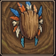
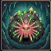

# Crater

A 2D side-view mining and exploration game inspired by the classic Diggers (1993). The purpose of this project is to scratch the itch of creating a game that I was thinking about for a long time, but the won't be enough time to do it. It is heavily vibe-coded to reach the initial version with all the core mechanics and ideas implemented as fast as possible. The code is most likely already spaghetti, but I will try to keep it as clean and organized as possible.

The game is available here: https://mcczarny.github.io/crater-js/

## Core Features
- **Mining and Exploration**: Dig through the underground world, discover resources and buy items to upgrade your characters and bases.
- **Multiple Races**: Play as one of three unique races, each with their own abilities and playstyles.
- **Abilities**: Use special when exploring and mining to gain advantages or overcome obstacles.

## Races

### Tribe of the Mask

Tribal warriors wearing ceremonial masks. Their minds are connected to the Unity Tree. They have ability to create tools that can speed up digging. They can also teleport to the base camp, but it has a cooldown and temporarily reduces their stats after use.

### Cult of the Spore (Fungus)

Mole-like creatures with fungal growths on their bodies. They have a slimy, organic appearance, with glowing spores that emit light in dark areas. They have ability to climb on the walls, allowing them to move up or do not fall when moving over gaps. Climbing speed is slower than walking and they cannot dig while climbing. They can also release a cloud of spores that makes damage to nearby enemies.

### Order of the Seed (Petal)

Plant-like beings, with the ability to manipulate plant life around them. They can create temporary platforms from vines and roots, allowing them to reach otherwise inaccessible areas. They can slowly regenerate health over time.

-----------

More detailed documentation about the game may be found in the [Clanker Docs](README-clanker.md). 